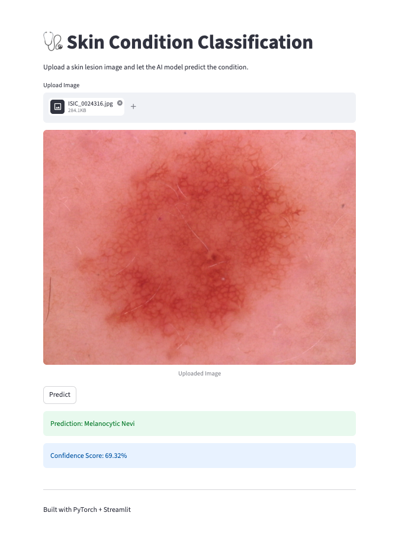

# 🩺 Skin Condition Classification using PyTorch + Streamlit

A deep learning computer vision project that classifies skin lesion conditions using **PyTorch**, **Transfer Learning**, and **Streamlit**.

This project uses the **HAM10000 dataset** and a pretrained **ResNet18 CNN model** to predict different types of skin conditions from uploaded skin lesion images.

---

# 🚀 Features

✅ Deep Learning Image Classification  
✅ Transfer Learning with ResNet18  
✅ PyTorch Training Pipeline  
✅ HAM10000 Skin Lesion Dataset  
✅ Streamlit Web Application  
✅ Image Upload & Prediction  
✅ Real-Time Inference  
✅ Validation Accuracy Tracking  

---

# 🧠 Tech Stack

- Python
- PyTorch
- Torchvision
- Streamlit
- Pandas
- NumPy
- PIL (Pillow)
- Scikit-learn

---

# 📂 Dataset

Dataset used:

**HAM10000 — Human Against Machine with 10,000 Training Images**

The dataset contains 7 skin lesion classes:

| Class | Description |
|---|---|
| akiec | Actinic Keratoses |
| bcc | Basal Cell Carcinoma |
| bkl | Benign Keratosis-like Lesions |
| df | Dermatofibroma |
| mel | Melanoma |
| nv | Melanocytic Nevi |
| vasc | Vascular Lesions |

Dataset Source:

[Kaggle HAM10000 Dataset](https://www.kaggle.com/datasets/kmader/skin-cancer-mnist-ham10000?utm_source=chatgpt.com)

---

# 🏗️ Project Structure

```text
Skin Condition Classification using PyTorch + Streamlit/
│
├── data/
│   ├── metadata.csv
│   └── images/
│
├── models/
│   └── model.pth
│
├── src/
│   ├── dataset.py
│   ├── train.py
│   ├── inference.py
│
├── app.py
├── requirements.txt
└── README.md
```

---

# ⚙️ Installation

Clone the repository:

```bash
git clone https://github.com/ranavandana94/skin-condition-classifier-pytorch.git
```

Move into project folder:

```bash
cd skin-condition-classifier-pytorch
```

Create virtual environment:

```bash
python3.10 -m venv venv
```

Activate environment:

### macOS/Linux

```bash
source venv/bin/activate
```

Install dependencies:

```bash
pip install -r requirements.txt
```

---

# 🚀 Train the Model

Run:

```bash
python src/train.py
```

The trained model will be saved inside:

```text
models/model.pth
```


---

# 🚀 Run the Streamlit App

Start the app:

```bash
streamlit run app.py
```

Then open the browser URL shown in terminal.

---

# 🖼️ App Features



The Streamlit application allows users to:

- Upload skin lesion images
- Run AI-based prediction
- View predicted skin condition
- View confidence score

---

# 📈 Model Performance

| Metric | Result |
|---|---|
| Validation Accuracy | ~64% |
| Model | ResNet18 |
| Framework | PyTorch |

---

# 🧪 Training Details

- Transfer Learning Enabled
- ResNet18 Backbone
- CrossEntropyLoss
- Adam Optimizer
- Image Normalization
- Train/Validation Split

---

# 🔮 Future Improvements

- Data augmentation
- Hyperparameter tuning
- GPU training
- Grad-CAM visualizations
- UI improvements
- More advanced architectures (EfficientNet, Vision Transformers)

---

# 📸 Sample Workflow

1. Upload skin image
2. Model preprocesses image
3. CNN predicts skin condition
4. Confidence score displayed


---

# 👤 Author

**Vandana Rana**

GitHub:  
[GitHub Profile](https://github.com/ranavandana94/skin-condition-classifier-pytorch)

